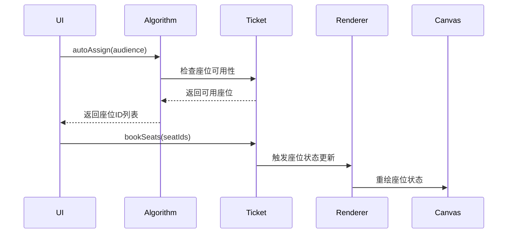

## 电影院选座系统任务文档
### 暂定分工安排
#### 1. canvas绘图与交互
* 弧形座位布局的绘制。基本功能需要200个座位每排20个，扩展功能要求不同数目的放映厅，可以和选座算法的同学协商一下怎么安排。
* 座位状态可视化。座位号、空座绿色、选中未售座位黄色、已售座位红色等等。
* 鼠标效果事件的效果。如点击、悬停、按ctrl点击多选等事件的画面效果。
* 优化绘制性能防止太卡顿，不要每次都全图绘制之类的，不过感觉可能并不需要。
* 其他作业文档中的效果。
主要实现逻辑放在js/modules/renders/目录下，和ui集成的同学一起负责style.css
#### 2. 选座算法
* 实现文档中的年龄限制规则。
* 团体票选座机制。
* 相应的自动选座推荐逻辑。
* 其他文档要求的选座算法。
主要实现逻辑放在js/modules/algorithms/目录下
#### 3. 票务数据库设计
* 设计票务状态，如空闲、预订、取消、已售等等。
* 设计票的其他信息结构，包括票号、时间、座位号、票价、状态等。
* 管理观众信息的存储，处理团体票关联逻辑等。
主要实现逻辑放在js/modules/ticket/目录下
#### 4. ui集成与功能整合
* 与绘图的同学交流，设计控制面板等等。
* 考虑进度，集成各模块功能。
* 编写一些测试用例。各部分的同学自己当然也可以想一些测例。
* 确认配置切换（100/200/300座位数等）后功能正常。
* 编写用户使用文档，报错提示等。说明文档占20分，可能需要大家一起补充。
构建html,style.css的框架，写js/app.js（应用入口），维护docs文档

答辩前还需要确认负责讲解和制作ppt的同学，不过也可以做完再考虑。
### 项目结构（目前）
/cinema-seat-booking
├── index.html                  # 主页面（UI集成者负责）
├── css/
│   └── style.css               # 全局样式（UI集成者负责）
├── js/
│   ├── interfaces/             # 接口定义（团队共同维护）
│   │   ├── SeatInterface.js
│   │   ├── TicketInterface.js
│   │   └── AlgorithmInterface.js
│   ├── modules/               # 模块实现
│   │   ├── renderer/          # 绘图模块 # 座位排列算法
│   │   ├── algorithm/         # 选座算法
│   │   └── ticket/            # 票务系统
│   ├── services/              # 公共服务
│   │   ├── EventBus.js        # 事件总线
│   │   └── StorageService.js  # 本地存储(不一定需要)
│   ├── config/                # 配置系统（不一定需要）
│   └── app.js                 # 应用入口（UI集成者负责）
├── tests/                     # 测试代码
└── docs/                      # 文档
│   ├── 作业文档doc
│   └── 任务说明.md
之后可以补充各文件、功能之间的依赖关系。
（ai生成的大致流程）

#### 接口定义
放在js/interfaces目录下，具体实现在js/modules中
* 2025.6.27 在interfaces的.js文件中定义了最基本的座位、电影票、选座算法的结构；以及EventBus.js中的事件总线类；
### 项目进度
&emsp;每2~3天确认一下进度，预计在7.10前完成。
